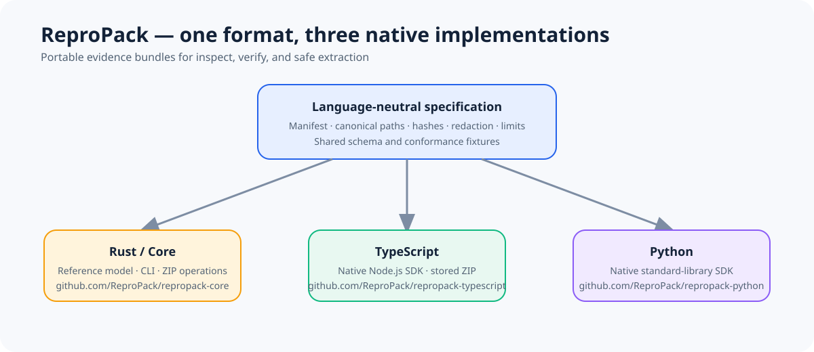

# ReproPack Core

<p align="center">
  
</p>

<p align="center"><strong>Portable, inspectable evidence bundles for software failures and development problems.</strong></p>

<p align="center">
  <a href="https://github.com/ReproPack/repropack-core/actions/workflows/ci.yml"></a>
  <a href="LICENSE"></a>
  <a href="docs/SPECIFICATION.md"></a>
</p>

ReproPack gives teams a small, deterministic format for sharing the evidence needed to understand a failure: logs, test output, metadata, and explicitly selected files. The bundle can be inspected and verified without running its contents.

## What this repository owns

This is the canonical project repository. It contains:

- the language-neutral [format specification](docs/SPECIFICATION.md) and JSON schema;
- the shared [conformance fixtures](docs/CONFORMANCE.md);
- the Rust reference model, bundle operations, and CLI;
- the security, compatibility, release, and contributor documentation.

The native implementations are independent repositories:

| Implementation | Best for | Repository |
| --- | --- | --- |
| Rust | CLI, validation, and the reference implementation | [repropack-core](https://github.com/ReproPack/repropack-core) |
| TypeScript | Node.js applications and tooling | [repropack-typescript](https://github.com/ReproPack/repropack-typescript) |
| Python | Python automation and analysis | [repropack-python](https://github.com/ReproPack/repropack-python) |

## Why ReproPack?

Reproduction artifacts are often scattered across terminals, CI logs, temporary directories, and issue comments. ReproPack makes the handoff explicit and auditable:

1. select the evidence intentionally;
2. record canonical metadata and SHA-256 digests;
3. redact before hashing when redaction is required;
4. validate, verify, and extract safely in another environment.

The format is transport, not execution. ReproPack does not replay commands, reconstruct environments, guarantee that evidence contains no secrets, or create a sandbox.

## Quick start

Install Rust, then run the real minimal workflow from this repository:

```bash
cargo run -- capture examples/minimal/manifest.json target/minimal.rpk \
  evidence/message.txt=examples/minimal/evidence/message.txt
cargo run -- inspect target/minimal.rpk
cargo run -- validate target/minimal.rpk
cargo run -- verify target/minimal.rpk
cargo run -- extract target/minimal.rpk target/minimal-extracted
```

The full walkthrough is in the [tutorial](docs/TUTORIAL.md). For automation, use `--json` and check the documented exit codes in [troubleshooting](docs/TROUBLESHOOTING.md).

## Navigate the project

- [Specification](docs/SPECIFICATION.md) — normative format and semantics.
- [Architecture](docs/ARCHITECTURE.md) — repository boundaries and implementation roles.
- [Format examples](docs/FORMAT_EXAMPLES.md) — valid manifest and bundle shapes.
- [Conformance](docs/CONFORMANCE.md) — shared fixtures and expected behavior.
- [Security](SECURITY.md) — threat model, limits, and reporting guidance.
- [Development and testing](docs/DEVELOPMENT_MODEL.md) — contributor workflow.
- [Roadmap](ROADMAP.md) — evidence-based project phases.
- [Release checklist](RELEASE_CHECKLIST.md) — preparation and publication gates.

## Current status

Phases 0–14 are complete as a local release-candidate foundation. The corrected v0.1.1 candidate is synchronized to GitHub and its required hosted CI passed. Public tags, GitHub Releases, and registry publication remain separate release actions; the existing local v0.1.0 tags are preserved.

## License

MIT. See [LICENSE](LICENSE).
