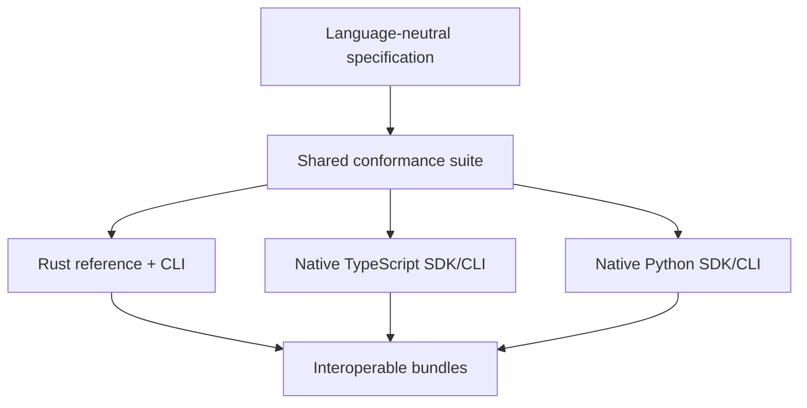

# Architecture

The core repository coordinates semantics and fixtures. Implementations may share fixtures and documentation links, but not runtime code. The bundle boundary contains only declared metadata and evidence; no implementation may infer executable behavior from it.
